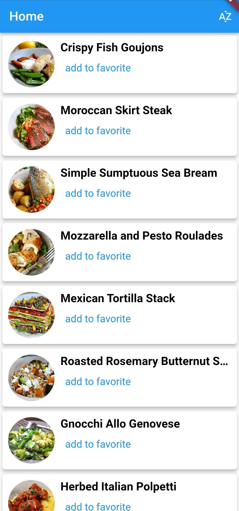
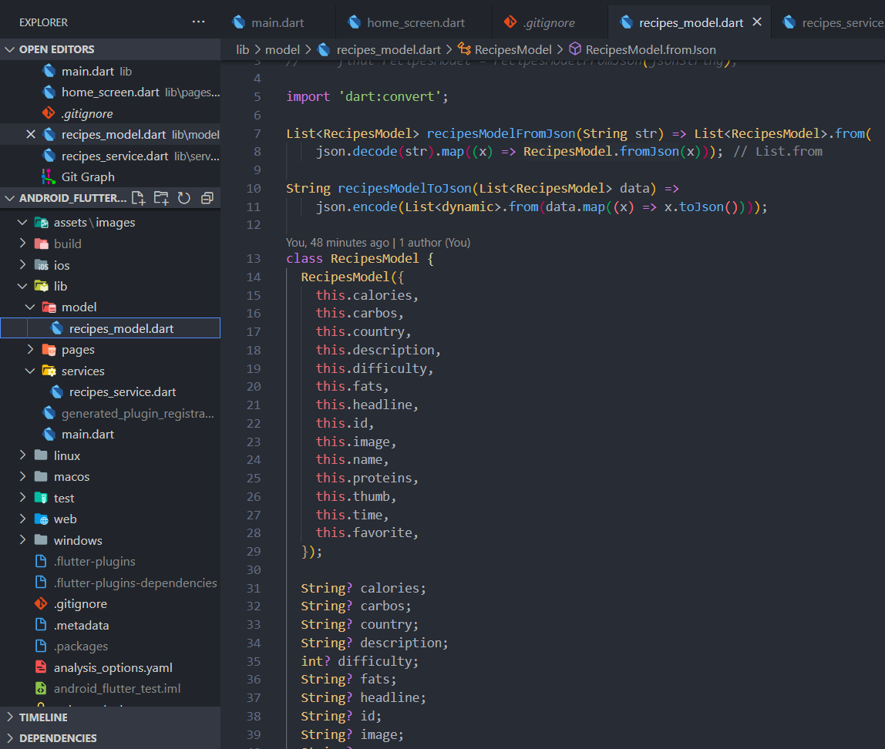
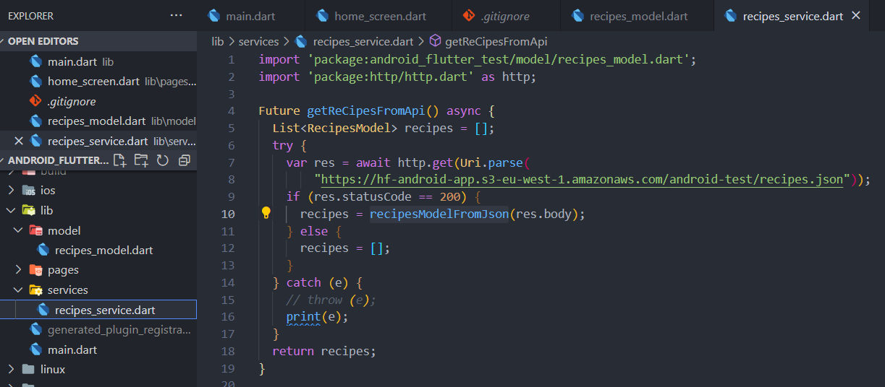
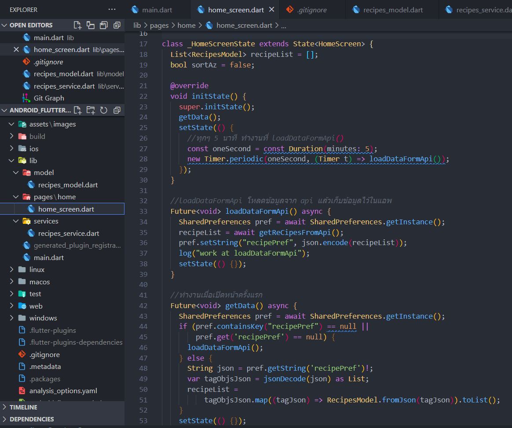
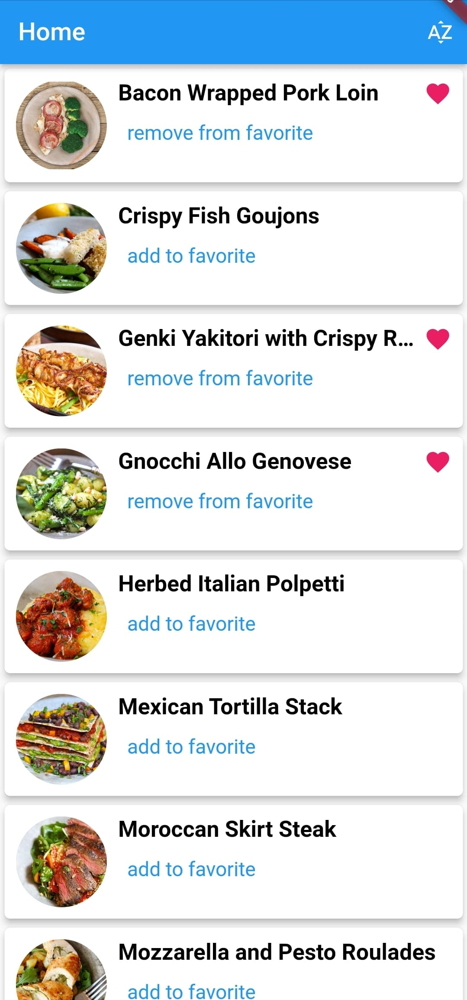
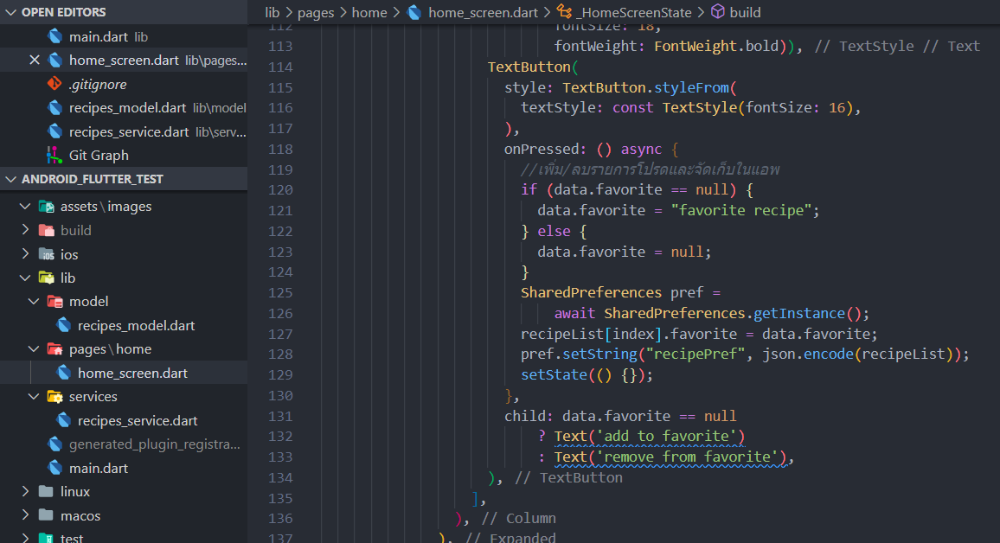
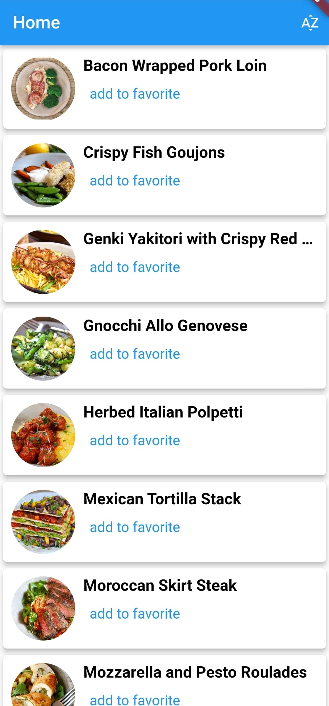
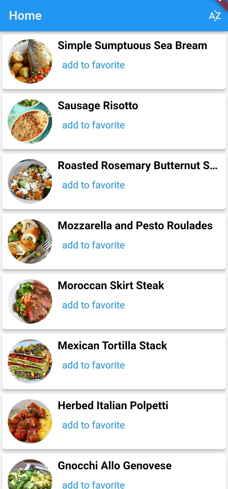
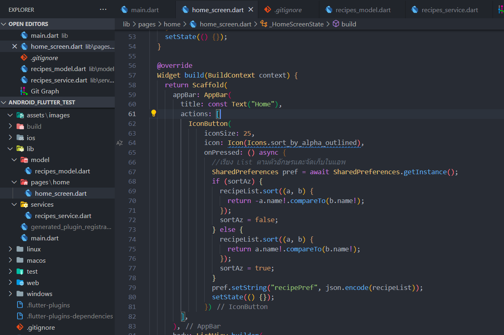

# android_flutter_test

การออกแบบและ algorithm

## การดึงข้อมูล

โดยจะมีการสร้าง class RecipesModel ทำการสร้างตัวแปรตามข้อมูลของ json เพื่อเป็น model สำหรับการเก็บค่าและแปลงข้อมูล Json นอกจากข้อมูลตัวแปลตาม json แล้วได้ทำการเพิ่มตัวแปร favorite ไว้เพื่อจัดเก็บรายการโปรด

ส่วนของการ get ข้อมูลจาก api จะทำผ่านเมดธอท getReCipesFromApi() และจะ return ค่าเป็น List ของ RecipesModel

ถัดมาจะเป็นส่วนของการนำข้อมูลไปใช้โดยจะเรียกใช้เมดธอทการทำงานจาก initState()
- เมื่อเปิดแอพพลิเคชั่นเริ่มแรกจะทำงานที่ getData() และจะเช็คข้อมูลในแอพว่ามีหรือไม่ ถ้าไม่มีจะไปทำงานที่ loadDataFormApi() เพื่อรับข้อมูลจาก api เก็บไว้มาใส่ใน ตัวแปรList recipeList เพื่อนำข้อมูลไปใช้กับหน้า ui และทำการจัดเก็บข้อมูลไว้ในแอพ
- เมื่อเปิดครั้งต่อไปก็ทำงานที่ getData() ถ้ามีข้อมูลอยู่ในแอพก็จะทำการดึงข้อมูลที่เก็บไว้มาใส่ใน ตัวแปรList recipeList เพื่อนำข้อมูลไปใช้กับหน้า ui
- ทุกๆ 5 นาทีใน initState() จะทำการเรียกใช้เมดธอท loadDataFormApi() เพื่อทำการรับค่าจาก api ใหม่อีกครั้ง

## รายการโปรด
รายการโปรดจะสามารถเลือกรายการโปรดโดยการกดที่ TextButton "add to favorite" และ ลบจากการกดที่ TextButton "remove from favorite"

ส่วนของการทำงานถ้ามีการกดปุ่มจะทำการเช็คว่ารายการนั้นได้เพิ่มข้อมูลเป็นรายการโปรดแล้วหรือไม่ ถ้ายังก็จะทำการเพิ่มข้อมูลเป็นรายการโปรด ถ้าเพิ่มแล้วจะทำการลบข้อมูลจากรายการโปรด โดยการอัพเดทข้อมูลใน Model และทำการจัดเก็บข้อมูลไว้ในแอพ 

## การจัดเรียง

การจัดเรียงจะสามารถทำงานโดยการกดปุ่มที่มุมขวาบนของ App bar

  

เมื่อ กดที่ปุ่มจะทำการตรวจสอบว่าจัดเรียงในรูปแบบ a-z หรือ z-a เมื่อจัดเรียง list ข้อมูลเสร็จแล้วก็จะทำการบันทึก list ที่มีการจัดเรียงนั้นไว้ในข้อมูลแอพ

